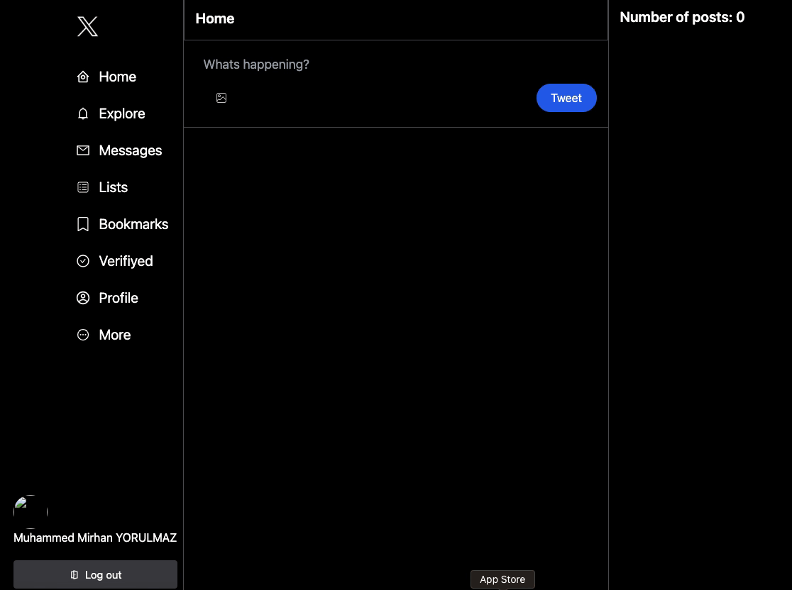

# Firebase-Twitter-Clone
A Twitter-like application built using Firebase that includes authentication via Google, sharing pictures with tweets, liking, editing, and deleting tweets

# Features
- Google Authentication: Users can sign up and log in using their Google accounts.
- Tweeting: Users can create tweets, which can include text and images.
- Liking Tweets: Users can like tweets, and the like count is updated in real-time.
- Editing and Deleting Tweets: Users can edit or delete their own tweets.
- Responsive Design: The app is optimized for both desktop and mobile devices.

# Technologies Used
- Frontend: HTML, CSS, JavaScript
- Backend: Firebase (Firestore, Firebase Authentication, Firebase Storage)

# Librarys
- react-router-dom
- react-toastify
- react-icons
- moment 
- uuid
- firebase
- tailwind

<h2>Screen </h2>

